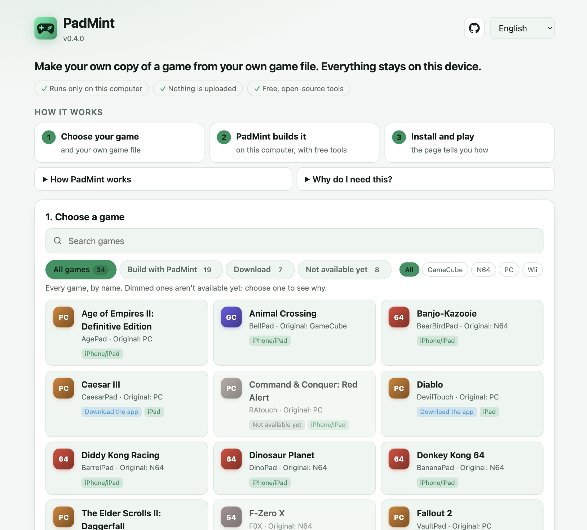

<p align="center">
  
</p>

<h1 align="center">PadMint</h1>

<p align="center">
  <strong>Make your own copy of a game from your own game file, on your own computer.</strong><br>
  One page for every game: choose it, pick your file, and PadMint builds it and tells you how to install it.
</p>

<p align="center">
  <a href="https://github.com/chrissotraidis/padmint/releases/latest"></a>
  <a href="https://github.com/chrissotraidis/padmint/actions/workflows/windows-package-check.yml"></a>
  
  
  <a href="https://discord.gg/xwHfUD2bxW"></a>
</p>

<p align="center">
  <picture>
    <source media="(prefers-color-scheme: dark)" srcset="docs/images/padmint-page-dark.png">
    
  </picture>
</p>

> **Two ready-to-play downloads skip the build:**
> **KartPad for Android** from the [latest KartPad](https://github.com/chrissotraidis/kartpad/releases/latest)
> (the app has the game code; you add your own game data, which PadMint can make from your disc), and
> **BlueWake for Windows** from [BlueWake's releases](https://github.com/chrissotraidis/bluewake/releases/latest).
> Everything else, including KartPad for iPhone and iPad, is built with PadMint from your own game file.

## Why PadMint exists

The game apps on these GitHub pages contain no game code. The game part is made
from **your own copy of the game**, on **your own computer**, and that is what
PadMint does. It also lists every game in one place, so you can see what each
one needs and where it stands, even games it can't build yet.

Your game file never leaves your computer and PadMint uploads nothing. The page
it opens is served by your own computer, and before anything starts it lists
every download, where it comes from, its size and the free space needed.

## Quick start

**1. Download** the ZIP for your computer from the
[latest PadMint](https://github.com/chrissotraidis/padmint/releases/latest):

| Your computer | Download | Open it |
|---|---|---|
| **Windows** 10 or 11 | `PadMint-v…-windows.zip` | Right-click the ZIP, choose **Extract All**, open the new folder and double-click **PadMint**. If Windows says it protected your PC, choose **More info**, then **Run anyway**. Python is included. |
| **Mac** | `PadMint-v…-macos.zip` | Once, run `xcode-select --install` in Terminal. Double-click the ZIP, open the folder and double-click **PadMint.command**. The first time, macOS says Apple could not verify it: choose **Done**, then **System Settings → Privacy & Security → Open Anyway**. |
| **Linux** | `PadMint-v…-linux.zip` | Unzip it and run `sh padmint.sh` in the folder. Needs Python 3.9+ and Git. |

**2. Keep the small window open.** It is PadMint working. Your web browser opens
the PadMint page; if it doesn't, open the `http://127.0.0.1…` address the
window shows. The page comes from your own computer, not a website.

**3. Choose your game and follow the page.** It speaks English, Spanish and
Portuguese (menu at the top right). Close the small window when you are done.

**What's in the folder you unzipped:**

```
PadMint-v…/
├── PadMint          double-click this (PadMint.command on Mac, padmint.sh on Linux)
├── Start here.txt   these steps, in English, Spanish and Portuguese
└── app/             PadMint itself: you don't need to open it
```

The `app` folder holds PadMint's code, the game list and these guides, and on
Windows a copy of Python. It is plain, readable source, so anyone can check what
PadMint does.

<details>
<summary><strong>Why a ZIP, and not an installer or a .dmg?</strong></summary>

An installer only helps if it is signed: Windows and macOS warn about unsigned
installers exactly as they warn about these launchers, and signing needs a paid
certificate for each system. One ZIP with a double-click launcher works the same
way on Windows, Mac and Linux, and every release is rebuilt from this repository
on separate computers and compared byte for byte before it is published. Signed
apps are a later step if players need them.

</details>


## What you can make, and where

The page sorts every game into one of three groups. Use **All games** to see
them all, or the tabs to narrow the list.

| Group on the page | What it means | What you need |
|---|---|---|
| **Build with PadMint** | PadMint builds the game on your computer from your game file, then tells you how to install it | For iPhone and iPad, and for Mac copies (CTRPad): a **Mac with Apple Silicon (M1 or newer)** with [Xcode](https://apps.apple.com/app/xcode/id497799835). KartPad also builds for Android on any Windows, Mac or Linux computer |
| **Download** | The game's app has no game files in it, so there is nothing to build: download it and add your own files in the app | Any computer to sideload an iPad or iPhone app with your own Apple ID |
| **Not available yet** | Listed so you can find it. Choosing it says why it isn't available and links to the game's page | — |

On Windows, Linux or an Intel Mac, games that need an Apple Silicon Mac stay in
the list, dimmed and tagged **Needs an M1+ Mac**, so you can see what they
need. For each game's exact versions, hosts and known problems, see
[build compatibility](docs/COMPATIBILITY.md).

## Using the page

1. **1. Choose a game.** Search or scroll; each card shows the original game,
   where it plays (iPhone/iPad, Android, Mac) and its group. **← All games**, or the
   PadMint logo at the top, takes you back to the full list. **About …: install guide and updates** opens the game's own page.
2. **2. Your own game file.** Click **Choose file…** and pick your disc image or
   ROM. Game files already in your Downloads folder are listed, so you can click
   one of those. PadMint checks the file straight away and says **✓** or what is
   wrong (wrong region, wrong version, incomplete file). Some games ask for the
   file inside the app instead; the page says so.
3. **3. Where will you play?** Choose the device you will play on, whichever
   computer you are using. **This Mac** appears for games with a Mac copy, on an
   Apple Silicon Mac: that copy plays on the Mac that builds it.
4. **What PadMint will do on this computer** lists everything before it starts:
   anything you need to install yourself first (it says **found** or **not found**),
   the source code and free build tools it downloads, and the free space needed.
   On a Mac, most games also show **Install these once, in Terminal:** the
   Homebrew line from the game's README, with a **Copy** button and a ✓ beside
   each package already installed. Run it once, then click **Make my copy**.

The page then shows a checklist: finding the latest release, downloading the
source, each tool with its progress, the build with its current step, and saving
your copy. Keep the computer plugged in; PadMint keeps it awake while it builds.
The first build of a game can take from a few minutes to a few hours. Finished
work is kept, so **Cancel** and later builds are safe and quicker.

When it finishes, the page shows **Your copy is ready**, the file it saved in
your Downloads folder and **What to do next**. If it stops, it says why: open
**Technical log** and use **Copy log for a bug report** when asking for help.

## Installing what you made

**iPhone or iPad:** PadMint saves `<Game>-v…-ios-personal.ipa`, the complete app
with your game inside. Install it with [Sideloadly](https://sideloadly.io),
[AltStore](https://altstore.io) or [SideStore](https://sidestore.io) and your own
Apple ID. To update, build the new version with PadMint and install it over the
old one with the same tool and Apple ID; your saves stay.

**Mac (CTRPad):** PadMint saves `<Game>-v…-macos-personal.zip`. Open it, move the
app to Applications and open it; the game asks for your own game file. To update,
build the new version and replace the old app; your saves stay.

The `…-ios-unsigned.ipa` on a game's release page is PadMint's starting point:
it has no game code, so it can't play by itself.

**Android (KartPad):** PadMint makes a `KartPad game data` folder. Install
KartPad's APK from the [latest KartPad](https://github.com/chrissotraidis/kartpad/releases/latest),
copy the folder to the phone, then in KartPad tap **Import Game** → **Import from
Extracted Game Data Folder…**. [KartPad's guide](https://github.com/chrissotraidis/kartpad#get-kartpad)
has every step.

Everything PadMint makes is made from your copy of the game: keep it to
yourself and don't share it.

## Android phone only (experimental)

This route makes KartPad's `KartPad game data` folder on a 64-bit Android
phone, without a computer. Most players should install
[KartPad's ready-to-play APK](https://github.com/chrissotraidis/kartpad/releases/latest)
and use a computer for the folder instead. It needs about 8 GB of memory, 25 GB
free, Wi-Fi for about 6 GB of downloads, and an hour or more, and has only been
tried on an emulator.

1. Install **Termux** from [F-Droid](https://f-droid.org/packages/com.termux/)
   or its [GitHub releases](https://github.com/termux/termux-app/releases)
   (the `arm64-v8a` APK), not Google Play. Open it once. If Android blocks the
   installation, don't bypass the warning: use a computer instead.
2. Copy your disc image into the phone's **Download** folder.
3. In Termux, paste this line and press Enter:

   ```
   curl -fsSL https://raw.githubusercontent.com/chrissotraidis/padmint/main/launchers/padmint-android.sh | sh
   ```

   It checks the phone first and says, before downloading anything, if it isn't
   64-bit or lacks memory or space. If setup stops, run the same line again;
   finished steps are kept.
4. Tap **Allow** if Android asks about your files. PadMint opens in the phone's
   browser: choose **KartPad**, tap your disc image and tap **Make my copy**.
   Keep Termux open, with the screen on, until the page says your copy is ready.

Next time, type `padmint` in Termux. If Android stops the build ("Process
completed (signal 9)"), turn on **Settings → System → Developer options →
Disable child process restrictions** and run `padmint` again. To free the space
afterwards: `proot-distro remove padmint`.

## Questions

Click a question to see the answer.

<details>
<summary><strong>My game isn't in the list, or it's dimmed.</strong></summary>

Choose it anyway: the page says why and what would work. **Needs an M1+ Mac**
means the iPhone/iPad copy is built on a Mac with Apple Silicon.
**Not available yet** means there is nothing to build or download through
PadMint yet; the game's page has the latest.

</details>
<details>
<summary><strong>Can I play KartPad on my Mac?</strong></summary>

Yes, on a Mac with Apple Silicon (M1 or newer) with Xcode: choose KartPad and
**This Mac**. PadMint builds KartPad from your disc and saves the app in your
Downloads folder. On an Intel Mac, PadMint builds KartPad for iPhone and iPad
(experimental), but the Mac app itself needs Apple Silicon.

</details>
<details>
<summary><strong>Can I build iPhone apps on Windows or Linux?</strong></summary>

In PadMint, only KartPad today, and that is experimental. HaloPad's Xbox
edition has its own route without a Mac:
[GitHub's free Mac runner builds it](https://github.com/chrissotraidis/projectreach#on-windows-linux-or-any-computer)
in your own copy of HaloPad's repository. Every other iPhone/iPad game needs a
Mac with Apple Silicon and Xcode for now. Building them on Windows is the next
priority, BlueWake first; PadMint will offer each one on Windows once that
game's release supports it.

</details>
<details>
<summary><strong>The window closed, or nothing seems to happen.</strong></summary>

PadMint opens a page in your web browser. If no browser opened, the PadMint
window shows a link starting with `http://127.0.0.1`: open it. The first time,
it can take a minute before the page opens or a build gets past **Starting…**.

</details>
<details>
<summary><strong>It says my file is the wrong version, region or size.</strong></summary>

Each game needs one exact version of the game, named on its card and in its
README (for example KartPad needs the European disc, RMCP01). Use an untouched
1:1 dump: trimmed, patched or half-size files are refused on purpose.

</details>
<details>
<summary><strong>It says my file is stored only in iCloud (Mac).</strong></summary>

In Finder, right-click the file, choose **Download Now**, wait, then choose it
again.

</details>
<details>
<summary><strong>The app I made doesn't open on iOS or iPadOS 27.</strong></summary>

Build it again with PadMint and install it over the old copy; your saves stay.
Apps built with Xcode 27 have to use the newer app startup Apple requires, and
every game's latest release has it since 4 October, so a copy built before then
may not open on iOS 27. If a new copy still doesn't open, report it on the game's
issue page. The [compatibility page](docs/COMPATIBILITY.md#recorded-mac-builds-4-october)
has the details.

</details>
<details>
<summary><strong>Windows or macOS warns me about PadMint.</strong></summary>

Expected for a free tool without a paid certificate. Windows: **More info →
Run anyway**. Mac: **System Settings → Privacy & Security → Open Anyway**.
Only download PadMint from its
[releases page](https://github.com/chrissotraidis/padmint/releases/latest).

</details>
<details>
<summary><strong>It says a download was blocked, or it stops early.</strong></summary>

PadMint names the server it couldn't reach. Check your internet connection and
the device's date and time, then run PadMint again; finished downloads are kept.
Keep certificate checks and security software turned on.

</details>
<details>
<summary><strong>Linux asks me to install something (libxml2, Git).</strong></summary>

Run the command PadMint shows, for example `sudo apt install libxml2`, then
start PadMint again.

</details>
<details>
<summary><strong>Can someone send me their IPA or game data?</strong></summary>

No. It's made from their copy of the game, so sharing it means sharing the
game. Please don't ask for one or post yours.

</details>
<details>
<summary><strong>What was PadForge?</strong></summary>

PadMint's old name. PadMint moves your old PadForge folder over and keeps the
tools you already downloaded.

</details>
<details>
<summary><strong>Still stuck?</strong></summary>

Ask in the [Discord](https://discord.gg/xwHfUD2bxW) or open a
[PadMint issue](https://github.com/chrissotraidis/padmint/issues) for setup,
download or build problems. Include the game, your computer (Windows, Mac or
Linux), the device you're building for and the copied log. Keep game files,
keys and personal builds out of it. For a game that builds but has problems
while playing, use that game's issue page.

</details>

---

*The rest of this page is for developers and game maintainers.*

## All commands

Python 3.9 or newer; no packages needed. On Windows PadMint downloads Git
itself; on a Mac or Linux it uses the system's Git (`xcode-select --install`,
or your package manager, for example `sudo apt install git`). From this
repository:

```sh
python3 -m padmint list                      # supported games and platforms
python3 -m padmint make kartpad android --disc 'your disc.wbfs'   # the one-step path
python3 -m padmint                           # the PadMint page in your browser (start: terminal)
python3 -m padmint doctor kartpad            # check this computer (installs nothing)
python3 -m padmint tools kartpad --target android --repo /path/to/kartpad   # get pinned tools
python3 -m padmint get kartpad /path/to/kartpad   # download a game's source
python3 -m padmint doctor bluewake --repo /path/to/bluewake
python3 -m padmint audit path/to/file-or-folder   # release gate
python3 -m padmint history --repo /path/to/game-repo   # recorded builds
python3 -m padmint check-manifest /path/to/game-repo
python3 -m padmint plan bluewake --repo /path/to/bluewake \
  --revision FULL_REVIEWED_COMMIT --disc '/path/to/your disc.iso'
```

`plan` validates paths, checkout state and platform support and prints the
exact backend command without building. Change `plan` to `build` to run it.
Use `--target` to choose a platform the game declares (default `ios`),
`--source-only`/`--no-mods` where the game supports them, and `--jobs 1-8`.

Builds run on the platforms each game marks *verified* or *experimental*;
`list` shows the rest as *planned*. KartPad's Android game data builds on
Windows, Linux and macOS (x64 and ARM64) and, experimentally, on an Android
phone; iPhone/iPad builds need an Apple Silicon Mac, except KartPad, which
also builds experimentally on Windows or Linux. See [STATUS.md](STATUS.md)
for what has been verified on each.

The [catalog](catalog/) lists every public game: the ones PadMint builds, the
apps with nothing to build (`download`) and the ones not available yet
(`later`). [COMPATIBILITY](docs/COMPATIBILITY.md) has each game's status and
next step.

## How games plug in

Each game repository declares a `padmint.json` manifest (schema in
[padmint/manifest.py](padmint/manifest.py)): accepted inputs, platforms and
their status, the backend command, stages, requirements and publication
policy. PadMint's [catalog](catalog/) pins each supported game and carries an
interim manifest for repositories that do not have one yet. Game-specific
translation, patches and packaging stay in the game repository.
See [Adding a game](docs/ADDING_A_GAME.md) for a complete example.

## What a build does and does not do

This describes `plan`/`build` on a checkout you provide (`make` and the
guided start do the downloading for you).

- Keep the game checkout clean at a commit you have reviewed. `plan` and
  `build` do not download repositories or install tools; follow `doctor`'s
  suggestions or use `tools` and `get`.
- Builds, logs and records stay under the game's ignored `build/padmint/`.
  One PadMint build runs per checkout; Ctrl-C cancels and keeps finished work.
- Every personal output is checked for structure and provenance, then run
  through the release gate. The record labels it *personal build, not
  publishable* regardless of the gate result.
- Nothing is installed on a device or uploaded. A personal IPA still needs
  your own signing (AltStore, SideStore, Sideloadly or Xcode).

## The release gate

`padmint audit` scans files, folders and ZIP-based packages for console keys,
address-named translated game functions, embedded original program sections
and provenance declaring translated game code. It fails closed on archives it
cannot inspect. Keys are identified by a short prefix and a SHA-256 hash; this
repository contains no keys. A PASS is a heuristic result, not copyright or
licensing clearance.

Game inputs, generated game code, saves, keys, personal builds and optimization
profiles never belong in this repository.

## Tests

```sh
python3 -m unittest discover -s tests -v
```
